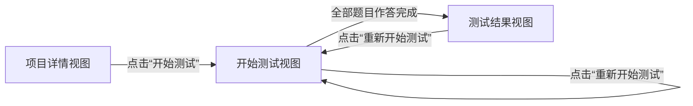

# MOMO TEST 产品需求文档 (PRD)

## 1. 项目概述

### 1.1 项目名称
**MOMO TEST**

### 1.2 项目定位
一个专注于心理测试和性格评估的在线测试平台，为用户提供丰富的测试项目，帮助用户更好地了解自己。

### 1.3 核心价值
- 提供多样化的测试项目（DISC性格测试、管理能力测试、发散思维测试等）
- 让用户通过科学的测试方法深入了解自己的性格特征和能力水平
- 提供专业的测试结果分析和建议

### 1.4 技术栈
- **前端技术**: HTML5、JavaScript、Tailwind CSS
- **项目类型**: 静态网站
- **部署方式**: 网页端

## 2. 功能需求

### 2.1 核心功能模块

#### 2.1.1 测试首页
**功能描述**: 集中展示各种测试项目，作为用户进入测试的入口页面

**页面结构**:
- 顶部：网站名称"MOMO TEST" + Logo
- 主体：测试项目卡片展示区域（瀑布流布局）
  - 采用响应式瀑布流布局
  - 桌面端：每行最多显示4个测试项目卡片
  - 平板端：每行最多显示3个测试项目卡片
  - 移动端：每行最多显示2个测试项目卡片
  - 小屏移动端：每行显示1个测试项目卡片
  - 卡片高度根据内容自适应
  - 支持无限滚动加载更多测试项目
- 每个测试项目卡片包含：
  - 测试项目图片（长方形图片，固定比例16:9）
  - 测试项目名称
  - 参与人数显示（格式：***W+人已经测试，随机生成1.1-19.9之间的数值）
  - "开始测试"按钮

**交互逻辑**:
- 点击"开始测试"按钮跳转到对应测试项目页面
- 支持响应式布局，适配不同屏幕尺寸

#### 2.1.2 测试项目页面
**功能描述**: 展示具体测试项目的详细信息，引导用户开始测试.

**页面结构**:
（说明：测试项目页面内包含三个视图：项目详情视图、开始测试视图、测试结果视图；通过同页状态切换显示不同内容，不另起新页面。）
1. **面包屑导航栏**
   - 首页 > 测试项目名称

2. **测试项目标题**
   - 显示测试项目名称

3. **测试作答区域**
   - 测试项目图片（与首页相同）
   - 参与人数显示（与首页保持一致）
   - 点赞功能：
     - 显示格式：***人点赞（随机生成100-999之间的数值）
     - 点击点赞按钮，人数+1，带有动画效果
   - "开始测试"按钮

4. **测试介绍内容框**
   - 每个测试项目有独立的介绍内容
   - 支持后期内容更新

5. **测试须知**
   - 统一内容：
     - "1、请根据自我情况或感受来选择。"
     - "2、测试结果仅供参考，不可替代诊断。"

**子视图状态流转图**:



ASCII 备选（当Mermaid不可用时）:
```
[项目详情视图]
        |
        | 点击“开始测试”
        v
[开始测试视图] -- 全部作答完成 --> [测试结果视图]
       ^   \
       |    \-- 点击“重新开始测试” --/
       |________________ 点击“重新开始测试” ________________|
```

#### 2.1.3 开始测试（同页视图）
**功能描述**: 用户进行实际测试的页面

**页面结构**:
- 继承测试项目页面的基础结构
- 测试作答区域内容替换为：
  1. **进度条**
     - 显示当前题目进度
     - 格式：已完成题目数/总题目数

  2. **题目展示区域**
     - 显示当前题目内容
     - 支持单选题形式
     - 选择后自动跳转到下一题

  3. **重新开始测试按钮**
     - 点击后清空当前进度
     - 回到第一题重新开始

**交互逻辑**:
- 答题完成后自动切换到测试结果视图（同页）
- 支持题目间的平滑过渡

#### 2.1.4 测试结果（同页视图）
**功能描述**: 展示用户的测试结果和分析

**页面结构**:
1. 测试项目名称
2. 测试项目图片
3. 测试结果展示
   - 根据测试计算逻辑生成的结果
4. 结果分析展示
   - 详细的结果分析和建议

### 2.2 测试计算系统

#### 2.2.1 系统架构
- 每个测试项目拥有独立的题目库
- 每个测试项目拥有独立的计算逻辑
- 支持多种测试类型和评分方式

#### 2.2.2 测试项目配置
- 支持动态配置测试项目
- 支持添加新的测试类型
- 支持修改现有测试内容

## 3. 测试项目案例

### 3.1 DISC性格测试案例一

#### 3.1.0 测试介绍
19世纪20年代，美国心理学家威廉·莫尔顿·马斯顿创建了一个理论来解释人的情绪反应，在此之前，这种工作主要局限在对于精神病患者或精神失常人群的研究，而马斯顿博士则希望扩大这个研究范围，以运用于心理健康的普通人群，因此，马斯顿博士将他的理论构建为一个体系，即The Emotions of Normal People―“正常人的情绪”。

为了检验他的理论，马斯顿博士需要采用某种心理测评的方式来衡量人群的情绪反映－“人格特征”，因此，他采用了四个他认为是非常典型的人格特质因子，即Dominance－支配，Influence－影响，Steady－稳健，以及Compliance－服从。而DISC，正是代表了这四个英文单词的首字母。在1928年，马斯顿博士正是在他的“正常人的情绪”一书中，提出了DISC测评，以及理论说明。

目前，DISC理论已被广泛应用于世界500强企业的人才招聘，历史悠久、专业性强、权威性高。

#### 3.1.1 题目设计
**题目数量**: 5道单选题

**题目内容**:
1. 请按第一印象最快的选择，如果不能确定，可回忆童年时的情况，或者以你最熟悉的人对你的评价来从中选择。
   - 选项1：富于冒险:愿意面对新事物并敢于下决心掌握的人
   - 选项2：适应力强:轻松自如适应任何环境
   - 选项3：生动:充满活力,表情生动,多手势
   - 选项4：善于分析:喜欢研究各部分之间的逻辑和正确的关系

2. 请按第一印象最快的选择，如果不能确定，可回忆童年时的情况，或者以你最熟悉的人对你的评价来从中选择。
   - 选项1：坚持不懈：要完成现有的事才能做新的事情
   - 选项2：喜好娱乐：开心充满乐趣与幽默感
   - 选项3：善于说服：用逻辑和事实而不用威严和权利服人
   - 选项4：平和：在冲突中不受干扰，保持平静

3. 请按第一印象最快的选择，如果不能确定，可回忆童年时的情况，或者以你最熟悉的人对你的评价来从中选择。
   - 选项1：顺服：易接受他人的观点和喜好，不坚持己见
   - 选项2：自我牺牲：为他人利益愿意放弃个人意见
   - 选项3：善于社交：认为与人相处是好玩，而不是挑战或者商业机会
   - 选项4：意志坚定：决心以自己的方式做事

4. 请按第一印象最快的选择，如果不能确定，可回忆童年时的情况，或者以你最熟悉的人对你的评价来从中选择。
   - 选项1：使人认同：因人格魅力或性格使人认同
   - 选项2：体贴：关心别人的感受与需要
   - 选项3：竞争性：把一切当作竞赛，总是有强烈的赢的欲望
   - 选项4：自控性：控制自己的情感，极少流露

5. 请按第一印象最快的选择，如果不能确定，可回忆童年时的情况，或者以你最熟悉的人对你的评价来从中选择。
   - 选项1：使人振作：给他人清新振奋的刺激
   - 选项2：尊重他人：对人诚实尊重
   - 选项3：善于应变：对任何情况都能作出有效的反应
   - 选项4：含蓄：自我约束情绪与热忱

#### 3.1.2 计算逻辑
**答案统计表**:
| 序号 | D | I | S | C |
|------|---|---|---|---|
| 题1  | 1 | 3 | 2 | 4 |
| 题2  | 3 | 2 | 4 | 1 |
| 题3  | 4 | 3 | 1 | 2 |
| 题4  | 3 | 1 | 4 | 2 |
| 题5  | 3 | 1 | 4 | 2 |

**评分规则**:
- D代表：Dominance－支配型/控制者
- I代表：Influence－活泼型/社交者
- S代表：Steadiness－稳定型/支持者
- C代表：Compliance－完美型/服从者

**结果判定**:
- 统计各类型得分，最高分为测试结果
- 如出现并列最高分，则并列为测试结果

#### 3.1.3 结果分析内容

**Dominance－支配型/控制者**
高D型特质的人可以称为是"天生的领袖"。

在情感方面，D型人一个坚定果敢的人，酷好变化，喜欢控制，干劲十足，独立自主，超级自信。可是，由于比较不会顾及别人的感受，所以显得粗鲁、霸道、没有耐心、穷追不舍、不会放松。D型人不习惯与别人进行感情上的交流，不会恭维人，不喜欢眼泪，匮乏同情心。

在工作方面，D型人是一个务实和讲究效率的人，目标明确，眼光全面，组织力强，行动迅速，解决问题不过夜，果敢坚持到底，在反对声中成长。但是，因为过于强调结果，D型人往往容易忽视细节，处理问题不够细致。爱管人、喜欢支使他人的特点使得D型人能够带动团队进步，但也容易激起同事的反感。

在人际关系方面，D型人喜欢为别人做主，虽然这样能够帮助别人做出选择，但也容易让人有强迫感。由于关注自己的目标，D型人在乎的是别人的可利用价值。喜欢控制别人，不会说对不起。

描述性词语：积级进取、争强好胜、强势、爱追根究底、直截了当、主动的开拓者、坚持意见、自信、直率

**Influence－活泼型/社交者**
高I型特质的人可以称为是"天生的社交家"。

在情感方面，I型人是一个热情洋溢的人，乐观向上，善于表达，富有感染力，喜欢与人交往，充满活力。但是，由于过于乐观，I型人往往缺乏耐心，容易冲动，不够专注，有时显得不够稳重。

在工作方面，I型人是一个富有创意和想象力的人，善于激励他人，具有良好的沟通能力，能够营造积极的工作氛围。但是，由于缺乏条理性，I型人往往容易分心，难以专注于细节工作，有时显得不够务实。

在人际关系方面，I型人是一个受欢迎的人，善于建立人际关系，能够快速融入新环境，具有良好的团队合作精神。但是，由于过于关注他人的认可，I型人有时会显得不够独立，容易受到他人影响。

描述性词语：热情洋溢、乐观向上、善于表达、富有感染力、充满活力、富有创意、善于激励、沟通能力强

**Steadiness－稳定型/支持者**
高S型的人通常较为平和，知足常乐，不愿意主动前进。

在情感方面，S型人是一个温和主义者，悠闲，平和，有耐心，感情内藏，待人和蔼，乐于倾听，遇事冷静，随遇而安。S型喜欢使用一句口头禅："不过如此。"这个特点使得S型总是缺乏热情，不愿改变。

在工作方面，S型能够按部就班地管理事务，胜任工作并能够持之以恒。奉行中庸之道，平和可亲，一方面习惯于避免冲突，另一方面也能处变不惊。但是，S型似乎总是慢吞吞的，很难被鼓动，懒惰，马虎，得过且过。由于害怕承担风险和责任，宁愿站在一边旁观。很多时候，S型总是焉有主意，有话不说，或折衷处理。

在人际关系方面，S型是一个容易相处的人，喜欢观察人、琢磨人，乐于倾听，愿意支持。可是，由于不以为然，S型也可能显得漠不关心，或者嘲讽别人。

描述性词语：可靠、深思熟虑、亲切友好、有毅力、坚持不懈、善倾听者、全面周到、自制力强

**Compliance－完美型/服从者**
高C型的人通常是喜欢追求完美的专业型人才。

在情感方面，C型人是一个性格深沉的人，严肃认真，目的性强，善于分析，愿意思考人生与工作的意义，喜欢美丽，对他人敏感，理想主义。但是，C型人总是习惯于记住负面的东西，容易情绪低落，过分自我反省，自我贬低，离群索居，有忧郁症倾向。

在工作方面，C型人是一个完美主义者，高标准，计划性强，注重细节，讲究条理，整洁，能够发现问题并制订解决问题的办法，喜欢图表和清单，坚持己见，善始善终。但是，C型人也很可能是一个优柔寡断的人，习惯于收集信息资料和做分析，却很难投入到实际运作的工作中来。容易自我否定，因此需要别人的认同。同时，也习惯于挑剔别人，不能忍受别人的工作做不好。

对待人际关系方面，C型人一方面在寻找理想伙伴，另一方面却交友谨慎。能够深切地关怀他人，善于倾听抱怨，帮助别人解决困难。但是，C型人似乎始终有一种不安全感，以致于感情内向，退缩，怀疑别人，喜欢批评人事，却不喜欢别人的反对。

描述性词语：遵从、仔细、有条不紊、严谨、准确、完美主义者、逻辑性强

### 3.2 管理能力测试案例

#### 3.2.0 测试介绍
管理能力自测是一个帮助个人评估和提升其管理技能的重要工具。通过自测，管理者可以识别自己的优势和需要改进的领域，从而为职业发展制定更有效的计划。

#### 3.2.1 题目设计
**题目数量**: 15道单选题

**题目内容**:
1. 习惯于行动之前制定计划？
   - 选项1：是
   - 选项2：否

2. 经常处于效率上的考虑而更改计划？
   - 选项1：是
   - 选项2：否

3. 能经常收集他人的各种反映？
   - 选项1：是
   - 选项2：否

4. 实现目标是解决问题的继续？
   - 选项1：是
   - 选项2：否

5. 临睡前思考筹划明天要做的事情？
   - 选项1：是
   - 选项2：否

6. 事物上的联系、指令常常是一丝不苟？
   - 选项1：是
   - 选项2：否

7. 有经常记录自己行动的习惯？
   - 选项1：是
   - 选项2：否

8. 能严格制约自己的行动？
   - 选项1：是
   - 选项2：否

9. 无论何时何地，都能有目的的行动？
   - 选项1：是
   - 选项2：否

10. 能经常思考对策，扫除实现目标中的障碍？
    - 选项1：是
    - 选项2：否

11. 能每天检查自己当天的行动效率？
    - 选项1：是
    - 选项2：否

12. 经常严格查对预定目标和实际成绩？
    - 选项1：是
    - 选项2：否

13. 对工作的成果非常敏感？
    - 选项1：是
    - 选项2：否

14. 今天预先安排的工作决不拖到明天？
    - 选项1：是
    - 选项2：否

15. 习惯于在掌握有关信息基础上制定目标和计划？
    - 选项1：是
    - 选项2：否

#### 3.2.2 计算逻辑
**评分规则**:
- 选择"是"得1分
- 选择"否"得0分
- 总分范围：0-15分

**结果判定**:
- 0-5分：管理能力很差。但你具有较高的艺术创造力，适合从事与艺术有关的具体工作。
- 6-9分：管理能力较差。这可能与你言行自由，不服约束有关。
- 10-12分：管理能力一般，对你的专业方面的事务性管理尚可。管理方法经常受到情绪的干扰是最大的遗憾。
- 13-14分：管理能力较强。能稳重、扎实地作好工作，很少出现以外或有损组织发展的失误。
- 15分：管理能力很强。擅长有计划地工作和学习，尤其适合管理大型组织

## 4. 技术实现要求

### 4.1 前端技术栈
- **HTML5**: 语义化标签，良好的页面结构
- **JavaScript**: 原生JS实现交互逻辑和测试计算
- **Tailwind CSS**: 响应式设计和现代化UI

### 4.2 页面结构
```
MOMO-TEST/
├── index.html              # 测试首页（独立页面）
├── test-detail.html        # 测试项目页面（内含详情/开始/结果三种视图）
├── css/
│   ├── style.css          # 自定义样式
│   └── masonry.css        # 瀑布流布局样式
├── js/
│   ├── main.js            # 首页交互与导航
│   ├── test-page.js       # 测试项目页内视图状态管理与渲染
│   ├── test-logic.js      # 测试计算逻辑
│   ├── masonry.js         # 瀑布流布局逻辑
│   └── utils.js           # 工具函数
└── assets/
    ├── images/            # 图片资源
    └── data/              # 测试数据
```

### 4.2.1 瀑布流布局实现方案
**CSS Grid + Flexbox 混合方案**:
- 使用CSS Grid实现响应式列布局
- 使用Flexbox实现卡片内部布局
- 通过JavaScript动态计算卡片高度
- 支持不同屏幕尺寸的断点切换

**响应式断点设置**:
- 大屏桌面端 (≥1200px): 4列布局
- 中屏桌面端 (992px-1199px): 3列布局  
- 平板端 (768px-991px): 2列布局
- 移动端 (576px-767px): 2列布局
- 小屏移动端 (<576px): 1列布局

**性能优化**:
- 图片懒加载
- 虚拟滚动（当测试项目数量过多时）
- 卡片高度缓存
- 防抖处理滚动事件

### 4.2.2 测试项目页内视图状态管理
**视图划分**:
- 详情视图（项目图片、W+人数、点赞、介绍、须知、开始测试按钮）
- 开始测试视图（进度条、单选题、重新开始）
- 测试结果视图（项目名、图片、测试结果、结果分析）

**状态与切换**:
- 使用原生 JavaScript 在 `test-detail.html` 内基于状态机切换视图（`detail | start | result`）。
- 切换方式：通过添加/移除 CSS 类或切换挂载容器内的 DOM 片段实现；可选使用 hash 片段（`#start`/`#result`）以支持浏览器返回键。
- 持久状态：W+人数、点赞数在首次进入页面时生成并在视图间保持一致；“重新开始测试”重置题目进度与作答记录，不重置 W+ 与点赞。
- 面包屑与标题根据当前子视图动态更新（例如：`首页 > {测试项目名称} > 开始测试`）。

### 4.3 功能实现要点

#### 4.3.1 数据管理
- 使用JavaScript对象存储测试题目和答案
- 实现测试结果的本地计算
- 支持测试进度的本地存储

#### 4.3.2 交互体验
- 平滑的页面切换动画
- 点赞功能的动画效果
- 进度条的实时更新
- 响应式设计适配移动端
- 瀑布流布局的平滑加载动画
- 无限滚动的懒加载机制

#### 4.3.3 测试系统
- 模块化的测试逻辑设计
- 支持多种测试类型的扩展
- 灵活的评分算法配置

## 5. 用户体验设计

### 5.1 视觉设计原则
- 简洁现代的界面设计
- 清晰的视觉层次
- 一致的交互模式
- 友好的色彩搭配

### 5.2 交互设计原则
- 直观的操作流程
- 及时的反馈机制
- 流畅的页面切换
- 便捷的导航设计

### 5.3 响应式设计
- 支持桌面端和移动端
- 适配不同屏幕尺寸
- 保持良好的可用性
- 瀑布流布局的自适应展示
- 卡片间距和边距的响应式调整
- 图片加载的渐进式显示效果

## 6. 项目规划

### 6.1 开发阶段
1. **第一阶段**: 基础页面结构和样式
2. **第二阶段**: 测试逻辑和交互功能
3. **第三阶段**: 测试项目和计算系统
4. **第四阶段**: 优化和测试

### 6.2 测试项目扩展
- 支持动态添加新的测试项目
- 提供测试项目配置接口
- 支持多种测试类型和评分方式

## 7. 成功指标

### 7.1 功能指标
- 所有测试项目正常运行
- 测试结果计算准确
- 页面交互流畅无卡顿

### 7.2 用户体验指标
- 页面加载速度快
- 操作流程简单直观
- 测试结果展示清晰

### 7.3 技术指标
- 代码结构清晰可维护
- 支持多浏览器兼容
- 响应式设计完善

---

**文档版本**: v1.0  
**创建日期**: 2024年  
**最后更新**: 2024年
